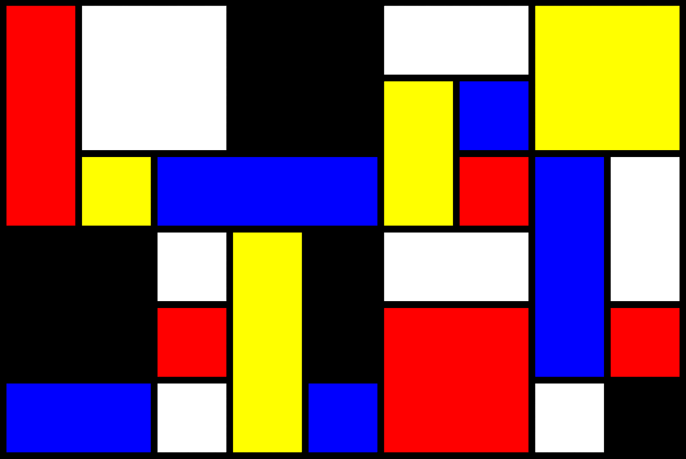
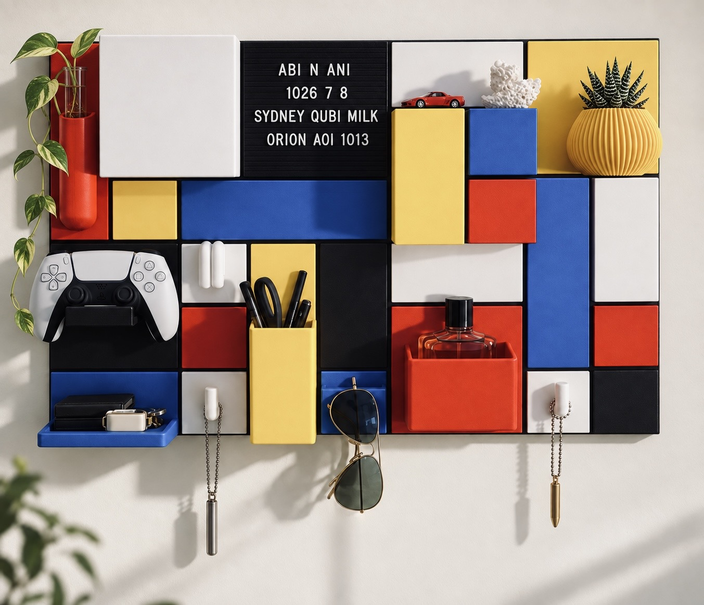
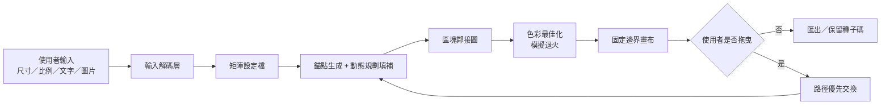
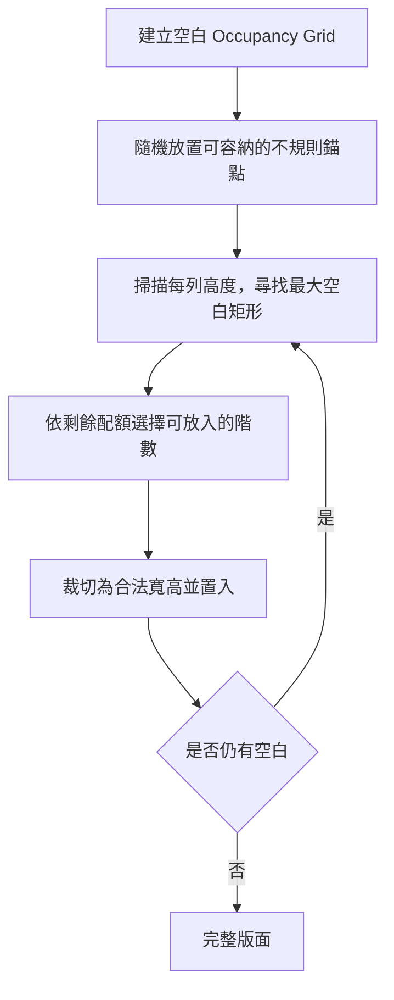
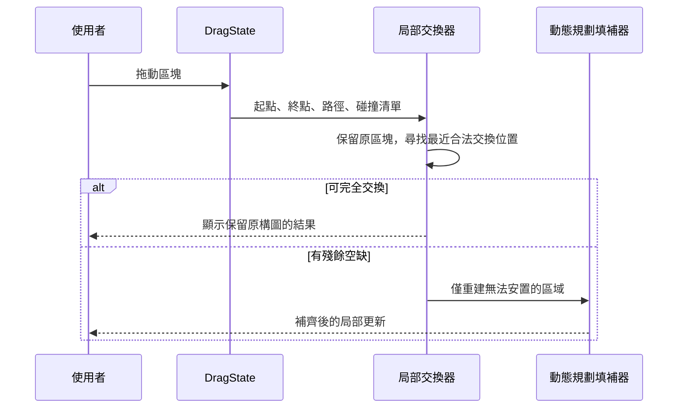
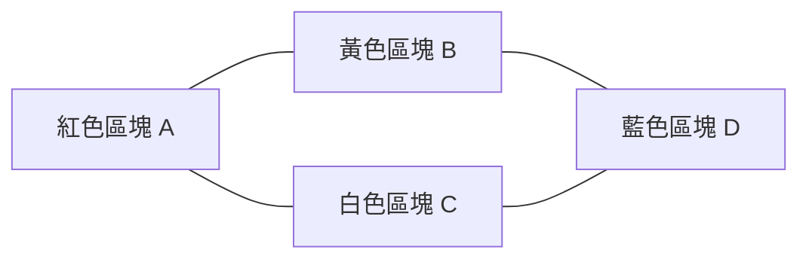
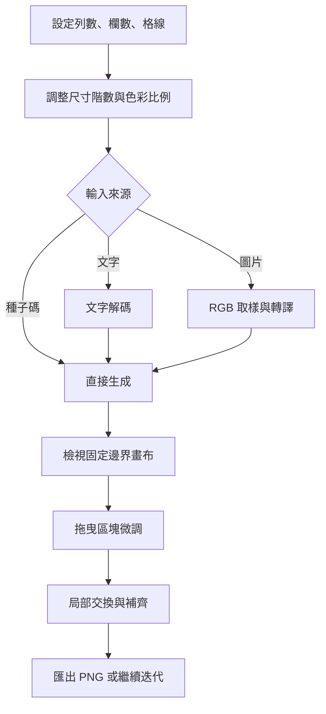

# [De Stijl Studio](https://destijl-design.vercel.app/)

> 一個以**有限矩陣邊界**為核心的生成式構圖與互動式配置工具，用於探索 **WORBY 造型牆面整理系統** 的排列組合；支援種子、文字與圖片輸入、拖曳重排、色彩最佳化，以及桌面與直式手機介面。




<p align="center">
  <a href="https://github.com/kent891026/destijl-design">原始碼</a>
  ·
  <a href="https://makerworld.com/models/2659800?appSharePlatform=copy">WORBY 原始列印作品</a>
</p>

---

## 目錄

1. [專案緣起](#專案緣起)
2. [問題定義與目標](#問題定義與目標)
3. [系統全貌](#系統全貌)
4. [核心資料結構](#核心資料結構)
5. [演算法設計](#演算法設計)
6. [時間與空間複雜度](#時間與空間複雜度)
7. [互動流程與操作介面](#互動流程與操作介面)
8. [技術架構](#技術架構)
9. [成果與效益](#成果與效益)
10. [執行方式](#執行方式)
11. [限制與後續方向](#限制與後續方向)
12. [致謝、來源與權利說明](#致謝來源與權利說明)

---

## 專案緣起

本專案始於一個很簡單實際的設計問題：當牆面整理模組系統能夠自由排列組合時，如何讓設計最大自由化，並在不依賴實體模型、考慮每一種方案的前提下，快速比較不同尺寸、比例與排列秩序，達到設計即成果。

我以 **WORBY – Wall Organizer with Red, Blue and Yellow** 作為延伸，設計了這個小型網站。提供一個獨立的「排列組合規劃與視覺化網站」：使用者先設定牆面的矩陣行列數和色塊尺度的比例，再以演算法生成、拖曳、交換與補齊去微調構圖，將抽象的風格派收納系統轉換為能即時排版的配置草案。

> **3D 列印作品**：WORBY – Wall Organizer with Red, Blue and Yellow，由 [Scott Yu-Jan（@scottyujan）](https://makerworld.com/@scottyujan) 發表於 [MakerWorld](https://makerworld.com/models/2659800?appSharePlatform=copy)。
>
> 本網站僅作為 De Stijl 配置靈感與視覺規劃工具；不包含上傳、轉發、修改或重新發布該作品的 3D 模型檔，也不代表與原作者或平台有合作關係。3D 模型的使用方式、衍生與商業權利請以原作品頁所載授權條款為準。

### 設計命題

| 現場配置的困難 | De Stijl Studio 的回應 |
| --- | --- |
| 單靠腦中想像，難以比較大量組合 | 以種子碼產生構圖，方便保留與迭代方案 |
| 不同現況比例不斷修改麻煩 | 將畫布視為固定 `50 × 50` 尺寸邊界，隨需求調整 |
| 按列印模型去創作時容易失去畫面感，缺少風格派的張力 | 以不規則錨點、最大矩陣與動態規劃填補，形成階梯狀與 T 型交界 |
| 微調後全部隨機重算，失去原意 | 優先沿拖曳路徑進行局部交換，只在確實無法排入時才局部重建 |
| 隨機上色容易產生同色大面積相鄰 | 建立區塊鄰接圖，以模擬退火降低相鄰同色的能量 |

---

## 問題定義與目標

### 輸入

- 矩陣列數 `R`、欄數 `C`，各介於 `1` 至 `50`
- 最大矩陣階數 `T`，各區塊的寬、高皆不可超過 `T`
- 色彩比例與尺寸比例滑軌（總和標準化為 `100%`）
- 種子碼、任意文字或圖片
- 任意拖曳色塊

### 輸出

在固定邊界中完整覆蓋且不重疊的區塊集合。每個區塊擁有位置、寬高、顏色與來源識別碼，並以正方形單位呈現。

### 成功條件

```text
1. 所有格點恰好被一個區塊覆蓋（無空洞、重疊）
2. 畫面不因行列比改變而壓縮格子比例
3. 區塊尺寸符合選定的階數分布
4. 色彩總量接近使用者指定比例，且鄰接同色盡量少
5. 拖曳後儘可能保留原有區塊與色彩
```

---

## 系統全貌



系統的資料流是單向的：任何輸入先被轉成可重現的數字設定檔，再交給版面與色彩引擎。讓**純種子碼生成**與**圖片／文字驅動生成**共享相同的排版邏輯，也便於比較不同方案。

---

## 核心資料結構

| 名稱 | 關鍵欄位 | 用途 |
| --- | --- | --- |
| `MatrixProfile` | `rows`, `columns`, `seed`, `source` | 描述一次生成所需的矩陣尺寸與來源資訊 |
| `Block` | `id`, `row`, `column`, `width`, `height`, `colour` | 畫布上的基本矩形區塊；寬高皆以矩陣單位表示 |
| `Ratios` | `white`, `red`, `blue`, `yellow`, `black` | 五種風格派色彩的目標配額比 |
| `SizeRatios` | `1...8` | 各尺寸階數的目標面積比 |
| `Occupancy Grid` | `R × C` 整數陣列 | 判斷該格是否已被區塊佔用 |
| `Adjacency Graph` | 節點為區塊、邊為共用邊界 | 計算色彩衝突與局部變更成本 |
| `DragState` | 起點、終點、經過路徑 | 讓拖曳操作可以優先採取局部交換 |

### 區塊與矩陣的關係

```text
Block A = { row: 4, column: 8, width: 3, height: 2, colour: blue }

佔用格點：
row 4~5、column 8~10，共 3 × 2 = 6 個單位格
```

這個表示法刻意將**視覺尺寸**與**瀏覽器像素**分離。演算法只處理整數矩陣，畫面渲染階段才把單位轉換為實際像素，因此同一方案可在電腦與手機維持相同結構。

---

## 演算法設計

### 1. 固定邊界與等比例單位

畫布不是隨內容延展的容器，而是一個固定的正方形邊界 `B × B`；預設 `B = 50`。令畫布可用像素邊長為 `S`，則單位格邊長為：

```math
u = \frac{S}{\max(R, C)}
```

畫面實際使用範圍為：

```math
W = C \cdot u, \qquad H = R \cdot u
```

因此短邊留下的是邊界中的留白，而不是被壓扁的格子。

| 設定 | 單位格大小 | 在 `50 × 50` 邊界中的結果 |
| --- | --- | --- |
| `50 × 50` | `S / 50` | 完整填滿邊界 |
| `40 × 50` | `S / 50` | 行向填滿；列向保留 10 個單位留白 |
| `25 × 25` | `S / 25` | 完整填滿邊界；單位格為前者 2 倍 |
| `20 × 30` | `S / 30` | 格子不變形，依比例置於邊界內 |

### 2. 尺寸階數與配額

使用者可用滑軌設定 `1` 到 `T` 階矩陣的比例。第 `t` 階區塊必須符合：

```math
1 \leq width, height \leq t, \qquad \max(width, height) = t
```

也就是說，當 `T = 4` 時，`4 × 1`、`4 × 2`、`4 × 3`、`4 × 4` 都是合法四階區塊；它保留模組化規則，同時避免所有切線一刀到底。

目標面積配額，以畫布總面積乘上正規化比例做估計：

```math
Q_t = R \cdot C \cdot \frac{P_t}{\sum_{k=1}^{T} P_k}
```

版面引擎的偏好函數：當某階數尚未達標時，演算法傾向選擇該階數；當空間條件不允許時，則優先確保覆蓋完整性。

### 3. 不規則錨點 + 最大空白矩形填補

單純從左上角依序切割會造成過度橫平豎直的視覺感，於是採用兩階段策略：



1. **錨點生成**：以固定種子建立偽隨機序列，先放入一批不同寬高與方向的區塊，打破全域對齊。
2. **最大空白矩形**：以每列累積高度的方式，從目前未佔用區域找出可用的大矩形，而不是只處理下一個空格。
3. **尺寸選擇**：根據尺寸配額、可用空間與種子隨機性選擇階數；超出邊界時裁切為合法的同階矩形。
4. **動態規劃填補**：反覆以當前空白區的最佳選擇填補，直到每個單位格都被覆蓋。

此方法在**可完全覆蓋**與**構圖不規則**之間取得平衡，可形成局部階梯、錯位與 T 型交界，較接近真實風格派配置的視覺節奏。

### 4. 拖曳：路徑優先的局部交換

拖曳不是將所有區塊打散重構。當一個區塊由起點移向目標位置時，系統依序處理：

1. 保留未受影響區塊與其既有顏色。
2. 取得拖曳終點和經過路徑上的衝突區塊。
3. 優先將衝突區塊搬到離原始位置或拖曳路徑最近的可用格點。
4. 若仍有無法容納的區塊，才移除少量衝突區塊。
5. 對缺口呼叫相同的矩陣填補引擎，依現有尺寸與色彩分布補足。



**先交換、後補洞**的設計比整張重構更符合使用上的操作直覺。拖曳是一次明確的構圖意圖，而非要求系統遺忘原本設計。

### 5. 文字與圖片的輸入解碼

| 輸入來源 | 轉譯方式 | 對構圖的影響 |
| --- | --- | --- |
| 種子碼 | 字串雜湊後餵入可重現偽隨機產生器 | 相同種子得到相同配置方向 |
| 文字 | 字元碼、雜湊值與文字長度轉為數值序列 | 影響矩陣大小、尺寸比例與色彩偏好 |
| 圖片 | 縮放取樣 RGB，映射至白／紅／藍／黃／黑色塊 | 影響顏色比例、構圖密度與生成種子 |

所有圖片分析都在瀏覽器端完成；網站不需要將圖片上傳至伺服器。圖片在這裡不是被直接做成像素畫，而是提供**色彩比例與構圖傾向**給矩陣版面引擎，因此仍能維持區塊化的風格派語言。

### 6. 鄰接圖與模擬退火色彩最佳化

每個區塊是圖上的一個節點；兩個區塊若共享一段邊界，便建立一條邊。色彩引擎交替嘗試交換兩個區塊的顏色，並以模擬退火決定是否接受新解。



能量函數由三部分組成：

```math
E = 90 \sum_{(i,j) \in \mathcal{E}} w_{ij}\,[c_i=c_j]
  + 0.55 \sum_k |U_k-Q_k|
  + 6 \sum_i [c_i \ne p_i]
```

| 項目 | 意義 | 設計效果 |
| --- | --- | --- |
| 鄰接同色懲罰 | 共用邊界的同色區塊會增加成本 | 優先避免大片重複填色 |
| 配額偏差 | 實際色彩面積偏離滑軌目標時增加成本 | 保持使用者設定的色彩比例 |
| 來源偏好 | 圖片輸入建議的顏色被改動時增加成本 | 不讓最佳化完全抹去輸入特徵 |

若新解降低能量便接受；若能量增加，仍以隨時間下降的機率暫時接受。這讓系統有機會跳離**局部上色卡住**的狀態。迭代次數設定為 `min(30,000, max(800, 30B))`，其中 `B` 為區塊數。

---

## 時間與空間複雜度

令 `N = R × C` 為單位格總數、`B` 為區塊數、`T` 為最大階數、`I` 為色彩最佳化迭代次數、`d` 為平均鄰接數。

| 模組 | 主要工作 | 時間複雜度 | 空間複雜度 | 說明 |
| --- | --- | --- | --- | --- |
| 邊界縮放 | 計算單位格像素尺寸 | `O(1)` | `O(1)` | 僅依 `max(R,C)` 計算 |
| 圖片取樣 | 對目標矩陣讀取色彩 | `O(N)` | `O(N)` | 以矩陣解析度為上限，而非原圖大小 |
| 錨點放置 | 嘗試候選矩形與佔用檢查 | 約 `O(A·T²)` | `O(N)` | `A` 為錨點數；`T ≤ 8` |
| 空白矩形搜尋 | 逐列維護高度並搜尋可用矩形 | 單輪 `O(N·T)` | `O(N)` | 實作上以小階數限制候選 |
| 完整填補 | 反覆處理剩餘空白 | 最壞 `O(B·N·T)` | `O(N+B)` | 畫布邊界 `50 × 50` 限制 |
| 建立鄰接圖 | 檢查水平與垂直格線 | `O(N)` | `O(B+E)` | `E` 為區塊相鄰邊數 |
| 色彩模擬退火 | 計算候選交換的局部能量 | `O(I·d)` | `O(B+E)` | 矩形圖的 `d` 通常很小 |
| 拖曳重構 | 搜尋路徑鄰近可放置位置 | 最壞 `O(D·N log N)` | `O(N+B)` | `D` 為受碰撞的區塊數 |

### 為何這個複雜度適合互動式介面？

1. 畫布上限固定為 `50 × 50 = 2,500` 個單位格，限制了最壞情況。
2. `T` 最大為 `8`，候選尺寸不會隨畫布線性膨脹。
3. 色彩交換只計算受影響區塊及其鄰居，避免每次掃描全畫面。
4. 拖曳優先局部交換；只有失敗時才需要補洞，降低大規模重算的頻率。

---

## 互動流程與操作介面

### 操作流程



### 介面設計原則

| 原則 | 實作方式 |
| --- | --- |
| 畫布優先 | 桌面版由滿版畫布承擔主視覺；控制面板為次要 |
| 極簡 UI | 深色低對比背景、圓角面板與即時畫面回饋 |
| 行動版設計 | 以直式堆疊控制面板做排版 |
| 操作方便性 | 畫布角落提供「重新生成」，方便手機使用 |
| 顯示易讀性 | 即時標示矩陣尺寸、輸入來源、比例與生成狀態 |

---

## 技術架構

| 層級 | 技術／模組 | 職責 |
| --- | --- | --- |
| Framework | Next.js 16、React 19、TypeScript | 建立可部署的單頁互動應用與型別安全的狀態管理 |
| UI | CSS、響應式 Media Queries | 深色極簡介面、桌面／行動版佈局與互動狀態 |
| Layout Engine | TypeScript 純函式 | 生成錨點、佔用格、最大空白矩形、動態規劃補齊 |
| Colour Engine | Graph + Simulated Annealing | 建立鄰接關係並減少相鄰同色區塊 |
| Input Decoder | Browser File API、Canvas API | 在本機讀取文字與圖片，轉成生成參數 |
| Export | Canvas／瀏覽器下載能力 | 將配置輸出為 PNG 圖檔 |

### 專案結構

```text
destijl-design/
├── app/
│   ├── layout.tsx                 # 全站文件與字型設定
│   └── globals.css                # 響應式視覺系統
├── src/
│   └── components/
│       └── DeStijlGenerator.tsx   # 互動介面、版面與色彩演算法
├── public/images/                 # README 靜態資源
├── package.json
└── README.md
```

---

## 成果與效益

### 已完成成果

| 成果 | 對使用者的意義 |
| --- | --- |
| 固定 `50 × 50` 邊界畫布 | 不同矩陣比例都保有正方格，適合比較尺度 |
| 最多 8 階的尺寸比例控制 | 可由細密網格到大面積模組，保留清楚的比例設計 |
| 階梯式切割構圖 | 產生較有節奏的分割，而非一刀切到底 |
| 色彩圖最佳化 | 減少同色相鄰，讓紅、黃、藍、黑、白的節奏更清楚 |
| 路徑優先拖曳 | 手動調整時盡量保存原構圖與原區塊 |
| 文字／圖片／種子三種入口 | 可從一首詩、紀念照或一段密碼做設計 |
| 完整行動版 | 手機直式介面仍保留滑軌、輸入、生成、拖曳與匯出流程 |

### 驗證紀錄

| 檢查項目 | 結果 | 意義 |
| --- | --- | --- |
| TypeScript／ESLint | 通過 | 確保目前程式碼符合專案靜態檢查規則 |
| Production build | 通過 | 可建立可部署的正式產物 |
| Desktop viewport | 通過 | 畫布優先、控制面板可操作 |
| Mobile portrait viewport | 通過 | 固定邊界、直式控制與角落重新生成皆可使用 |
| 生成與拖曳流程 | 通過 | 能維持完整覆蓋，並在局部衝突後補齊缺口 |

### 對 3D 列印配置工作的效益


這個工具的價值不在於替代實體量測或列印測試，而在於前期快速縮小設計搜尋空間：先用可重現種子保留候選案，再以手動拖曳加入設計判斷，最後才把少數方案帶到實作階段。

---

## 執行方式

### 環境需求

- Node.js 20 或以上
- npm

### 本機啟動

```bash
git clone https://github.com/kent891026/destijl-design.git
cd destijl-design
npm install
npm run dev
```

開啟 `http://localhost:3000` 後即可開始使用。

或是使用我部署好的網站ㄏ

### 品質檢查

```bash
npm run lint
npm run build
```

---

## 限制與後續方向

| 現階段限制 | 可延伸方向 |
| --- | --- |
| 演算法輸出是視覺配置草圖 | 加入模組實際寬高、牆面公差與 BOM 計算 |
| 圖片只萃取色彩與結構傾向 | 增加可調式影像特徵、語意標籤或區域權重 |
| 拖曳的局部重排仍可能需要少量補洞 | 使用最小成本流或精確覆蓋作為高精度重排模式 |
| 色彩最佳化採啟發式演算法 | 提供 Pareto 候選，讓使用者比較**色彩比例**與**相鄰差異** |
| 匯出目前以平面圖片為主 | 支援 SVG、列印標記、牆面裝配順序與分享連結 |

---

## 致謝、來源與權利說明

### 3D 列印作品來源

- 作品：**WORBY – Wall Organizer with Red, Blue and Yellow**
- 原作者：**[Scott Yu-Jan（@scottyujan）](https://makerworld.com/@scottyujan)**
- 作品頁：[MakerWorld – WORBY](https://makerworld.com/models/2659800?appSharePlatform=copy)
- 本專案與該作品的關係：以其「紅、藍、黃的模組化牆面整理」作為配置研究情境與設計靈感，建立獨立的網頁視覺規劃工具。

請在列印、修改、發布或商業使用原始 3D 模型前，直接閱讀並遵循 MakerWorld 原作品頁當前標示的授權條款。本專案不附帶該模型檔案，也不授與任何原模型相關權利。

### 專案作者與成果

**陳致穎 Kent Chen** · [@kent891026](https://github.com/kent891026)
**De Stijl Studio 網站**· [De Stijl Studio](https://destijl-design.vercel.app/)
---

<p align="center">
  為「設計及製造」而製作。<br />
  Last updated: 2026-09-17
</p>
