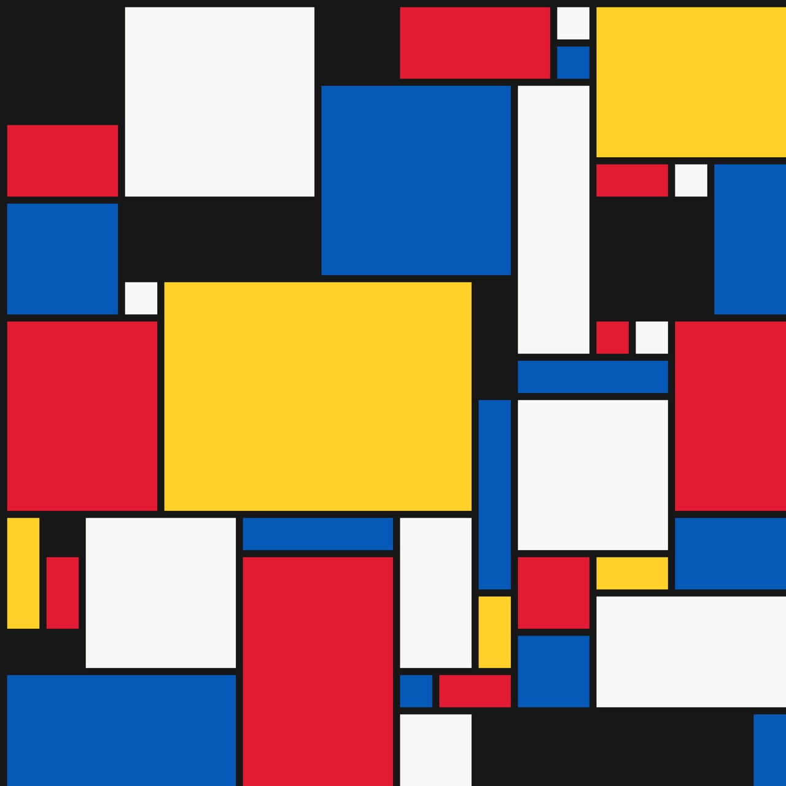

# De Stijl Studio

<p align="center">
  
</p>

一個用來探索風格派矩陣構圖與牆面模組排列的互動網站。使用者能設定矩陣、色彩與尺寸比例，以種子、文字或圖片生成方案，並直接拖曳區塊微調配置。

## 功能

- 固定邊界畫布：不同矩陣比例仍維持正方格，不會壓縮變形。
- 不規則區塊生成：依尺寸比例建立階梯式、錯位的矩形構圖。
- 色彩最佳化：降低相鄰同色區塊，同時維持設定的色彩配額。
- 拖曳重排：優先交換受影響區塊，只在必要時補齊空缺。
- 種子、文字與圖片輸入：將輸入轉為可重現的構圖參數。
- 桌面與手機直式介面：完整保留生成、調整與匯出功能。

## 專案結構

```text
app/                         # Next.js 路由、全站版面與樣式
components/
  DeStijlGenerator.tsx       # 主要互動介面與生成演算法
public/images/               # README 與網站使用的靜態圖片
package.json                 # 套件與指令
README.md                    # 專案說明
```

> 主要程式從 [components/DeStijlGenerator.tsx](components/DeStijlGenerator.tsx) 開始閱讀；畫面入口是 [app/page.tsx](app/page.tsx)。

## 技術

Next.js · React · TypeScript · Canvas API · CSS

## 本機啟動

```bash
npm install
npm run dev
```

檢查正式版本：

```bash
npm run lint
npm run build
```

## WORBY 配置情境與致謝

本網站以 **WORBY – Wall Organizer with Red, Blue and Yellow** 的模組化牆面整理概念作為排列研究情境，協助在列印與實體裝配前比較色彩與尺寸組合。

原始 3D 列印作品由 [Scott Yu-Jan（@scottyujan）](https://makerworld.com/@scottyujan) 發表：[MakerWorld – WORBY](https://makerworld.com/models/2659800?appSharePlatform=copy)。本網站是獨立的視覺規劃工具，不包含或散布原始 3D 模型檔；模型的使用與授權請以原作品頁條款為準。

## 作者

Kent Chen · [@kent891026](https://github.com/kent891026)
